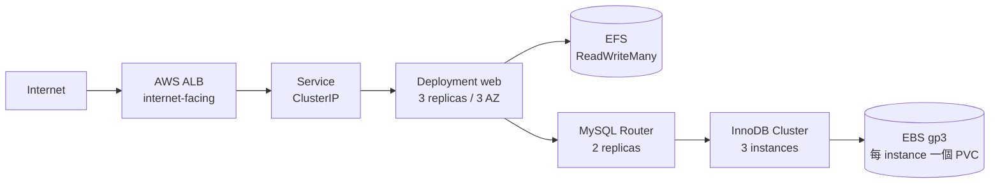

# 題目二：EKS 架構與 Kubernetes manifest

## 架構



## 設計決定

| 項目 | 決定 | 理由 |
|---|---|---|
| EKS 模式 | Standard + managed node group | Auto Mode 會把節點與 addon 的控制權收走，此題要展示的正是那一層 |
| Kubernetes | 1.36 | 仍在 EKS standard support |
| 網路 | 三 AZ，node 僅在 private subnet | 單 AZ 的 cluster 談不上高可用 |
| NAT | 每 AZ 一個 | 單一 NAT 掛掉會讓三個 AZ 一起失去 egress |
| API endpoint | private 開啟，public 僅開放 `admin_cidr` | 只留 public 又加白名單，等於把 node 自己鎖在外面 |
| Application 儲存 | Regional EFS，每 AZ 一個 mount target | EBS 只能在同一 AZ 重新掛載，跨 AZ 的三個 pod 無法共用 |
| MySQL 儲存 | 每 instance 各自 encrypted EBS gp3 | 資料庫的高可用來自 replication，不是共用磁碟 |
| Ingress | AWS Load Balancer Controller + ALB | 對應圖中的 `ing` |
| Database HA | Oracle MySQL Operator 的 InnoDBCluster | 見下 |
| AWS 權限 | EKS Pod Identity，四個獨立 role | 掛在 node role 上等於節點內每個 pod 都拿到同一份權限 |

### 為什麼不用 StatefulSet 跑 MySQL

把 `replicas` 開到 3 的 StatefulSet 得到的是三個各自獨立的 MySQL process：沒有
replication、沒有 writer 選舉、也沒有 failover。主節點掛掉不會有人接手，資料也不會
同步。InnoDBCluster 這三件事都由 operator 負責，Router 則在 failover 後自動跟上新的
primary，應用端連線位址不變。

### 高可用不是只有 replica 數量

| 機制 | 位置 |
|---|---|
| 三 AZ 分散 | `topologySpreadConstraints`，zone 用 `DoNotSchedule` 強制 |
| 節點維護時的保護 | `PodDisruptionBudget minAvailable: 2` |
| 慢啟動不被誤判 | `startupProbe` 先跑，之後才輪到 liveness |
| 流量不進未就緒的 pod | `readinessProbe` |
| EBS 與 pod 不同 AZ | StorageClass 用 `WaitForFirstConsumer` |

## 執行

```bash
cd terraform
terraform init
terraform apply -var="admin_cidr=<你的 IP>/32"

aws eks update-kubeconfig --region ap-northeast-1 --name asiayo

# application.yaml 的 StorageClass 需要填入實際的 EFS id
terraform output -raw efs_file_system_id

cd ../kubernetes
# 先建立 MySQL root secret，密碼不進 repo
kubectl create namespace asiayo
kubectl -n asiayo create secret generic asiayo-mysql-root \
  --from-literal=rootUser=root \
  --from-literal=rootHost=% \
  --from-literal=rootPassword='<password>'

kubectl apply -f application.yaml
kubectl apply -f mysql.yaml
```

## 驗證狀態

誠實交代：**這份答案沒有實際部署到 AWS。**

| 項目 | 狀態 |
|---|---|
| `terraform init` | 通過，所有 module 與 provider 版本可解析，產生 `.terraform.lock.hcl` |
| `terraform validate` | 通過（Terraform v1.15.8，0 errors、0 warnings） |
| `terraform fmt -check` | 通過 |
| YAML 語法與文件結構 | 已驗證（`yaml.safe_load_all`，9 份文件解析正常） |
| Kubernetes schema 驗證 | 未執行，本機無 cluster，`kubectl --dry-run=client` 需要 API server 做 discovery |
| `terraform plan` | 未執行，需要 AWS 憑證 |
| `terraform apply` | 未執行 |

`validate` 檢查的是語法、型別與 module 介面，不會驗證 AWS API 層面的參數組合；那要等 `plan` 與 `apply`。

## 已知未涵蓋

監控、備份、CI、Route53 與 ACM（ALB 目前為 HTTP）、Kustomize 或 Helm 化的應用程式打包。
題目要的是架構與高可用設計，這些屬於上線前的另一批工作。
